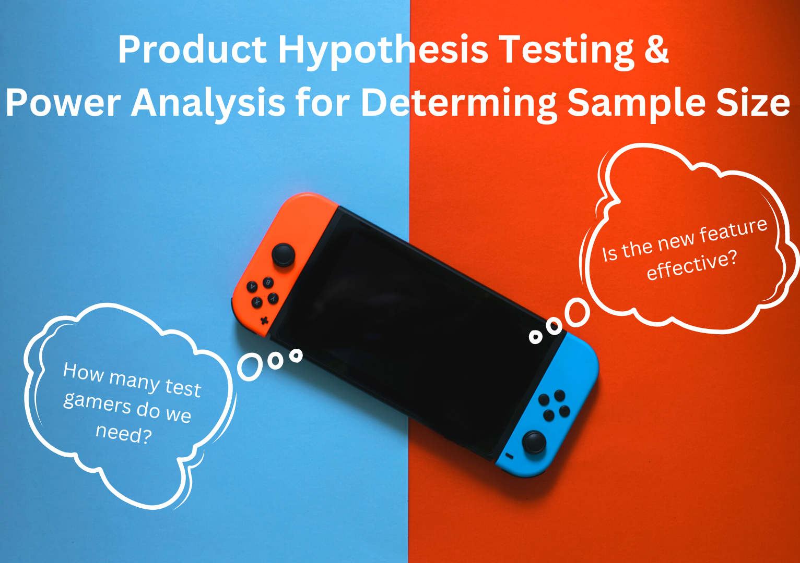
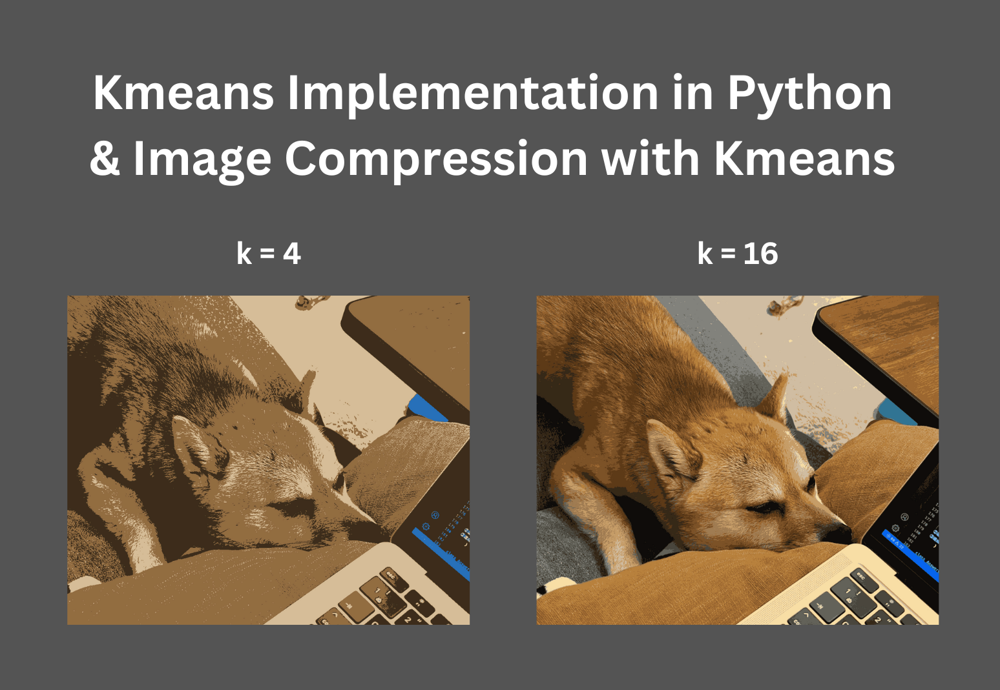
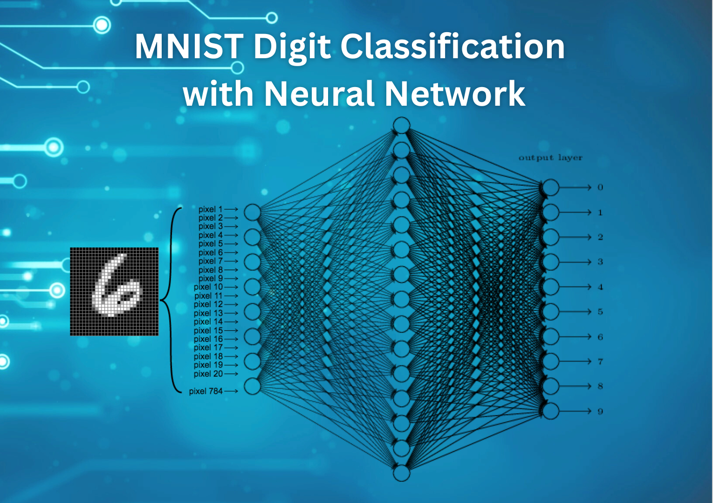
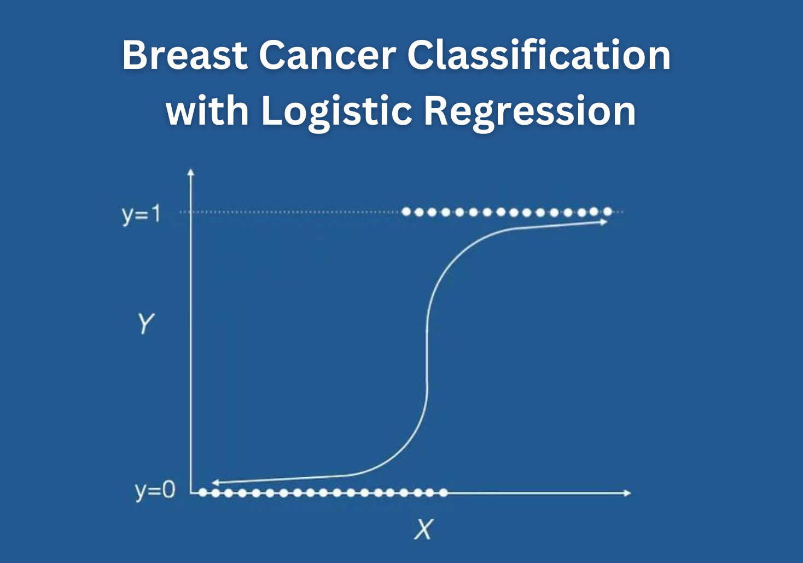
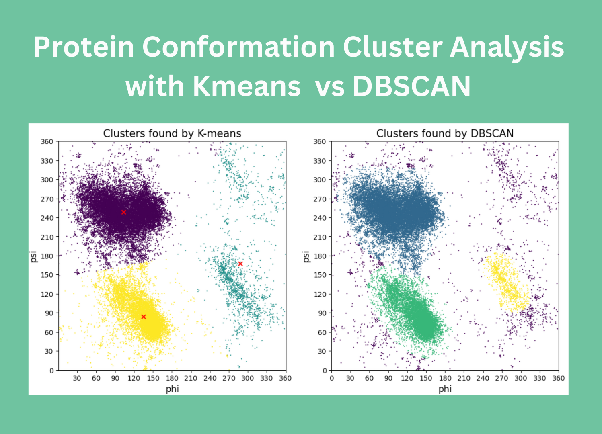
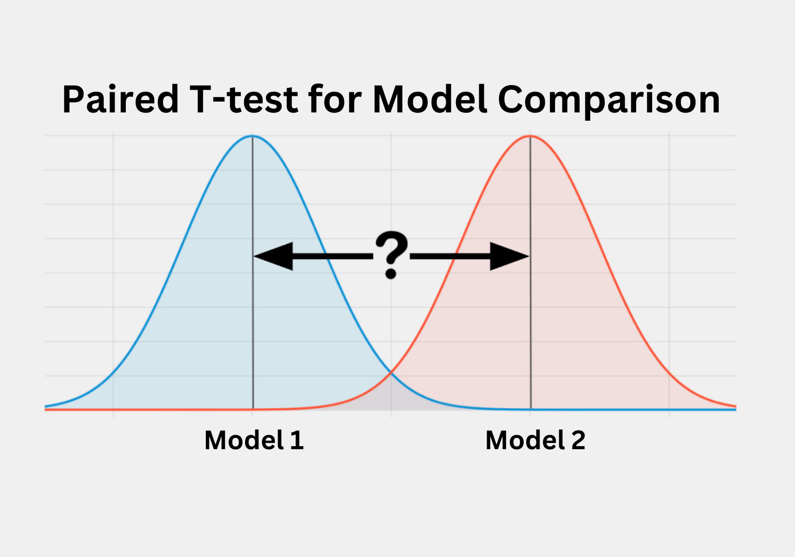
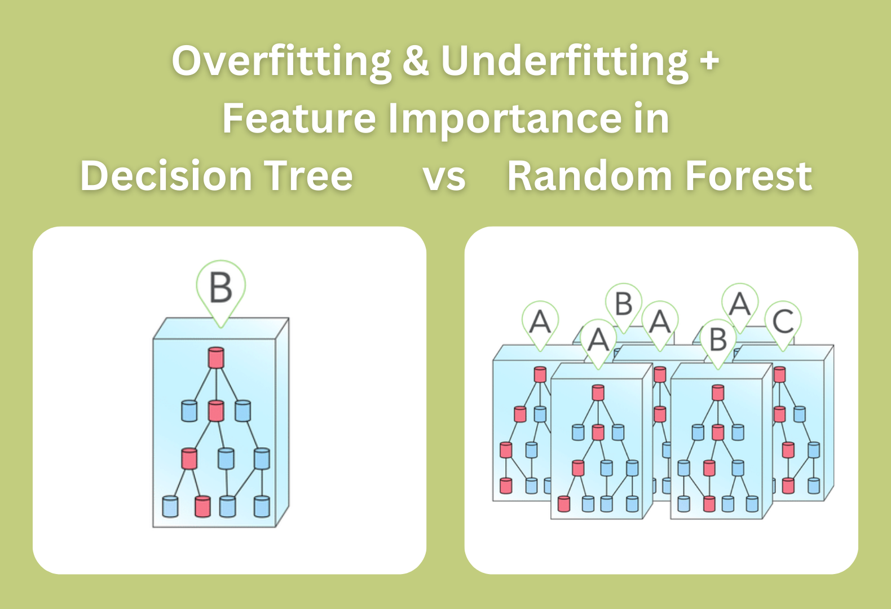

<h1 align="center"> Welcome to My Portfolio! </h1>

 
    
<b> I am a ... </b>

    <ul>
        <li>MSc. student in Data Science at the University of Gothenburg  
        with a strong passion for leveraging data and analytics for problem-solving and decision-making </li>
        <li>Financial Analyst Intern at Apple Japan</li>
        <li>former Data Science Intern at Spotify</li>
        <li>former Data Science Intern at Johnson&Johnson</li>
        <li>former Data Analyst at Nagase Brothers Inc.</li>
    </ul>
 

<h2 align="left"><b>Skills</b> </h2>

### Languages:
- Python (4.5+ years)
- SQL (1.5+ years)

### IDEs and Libraries:
- 

<h2 align="left"><b> Projects </b></h2>

## [Hypothesis Testing & Power Analysis for Product Development](https://deepnote.com/app/yura-ueno/Hypothesis-Test-and-Power-Analysis-5ffe7a7c-f051-45c7-8e27-bda688ba164d) 

**Description:** 
aaaa. <be>

**Tools used:**  Python, R markdown, SciPy, NumPy, seaborn, Kaggle<be>

**Keywords:** clustering, pattern recognition,  time series analysis, linear regression, predictive modeling, two-sample hypothesis test, data visualization <be>

## [Kmeans Implementation from Scartch in Python](https://deepnote.com/app/yura-ueno/Kmeans-Implementation-8cf0dda0-2458-45c5-9be1-4c9af4267584) 

**Description:** 
aaaaa. <be>

**Tools used:**  Python, R markdown, SciPy, NumPy, seaborn, Kaggle<be>

**Keywords:** clustering, pattern recognition,  time series analysis, linear regression, predictive modeling, two-sample hypothesis test, data visualization <be>

## [MNIST Digit Classification with Neural Network](https://deepnote.com/app/yura-ueno/Neural-Network-on-MNIST-Digits-c48c503b-d018-4a76-8fc4-6e1ada4eb8ea) 

**Description:** 
aaaaa. <be>

**Tools used:**  Python, R markdown, SciPy, NumPy, seaborn, Kaggle<be>

## [Breast Cancer Classification with Logistic Regression](https://deepnote.com/app/yura-ueno/Breast-Cancer-Classification-a1f36dc3-3558-4c42-af70-94dfa8d2fd79) 

**Description:** 
aaaaa. <be>

**Tools used:**  Python, R markdown, SciPy, NumPy, seaborn, Kaggle<be>

**Keywords:** clustering, pattern recognition,  time series analysis, linear regression, predictive modeling, two-sample hypothesis test, data visualization <be>

## [Protein Conformation Cluster Analysis with Kmeans & DBSCAN](https://deepnote.com/app/yura-ueno/Kmeans-vs-DBSCAN-16d362da-de59-47a3-b694-1b2bc3d740e9) 

**Description:** 
aaaaa. <be>

**Tools used:**  Python, R markdown, SciPy, NumPy, seaborn, Kaggle<be>

**Keywords:** clustering, pattern recognition,  time series analysis, linear regression, predictive modeling, two-sample hypothesis test, data visualization <be>

## [Paired T-test for Model Comparison](https://deepnote.com/app/yura-ueno/Paired-T-test-for-Model-Comparison-e8b6a0f0-7830-4892-9e0e-4555868162bb) 

**Description:** 
aaaaa. <be>

**Tools used:**  Python, R markdown, SciPy, NumPy, seaborn, Kaggle<be>

**Keywords:** clustering, pattern recognition,  time series analysis, linear regression, predictive modeling, two-sample hypothesis test, data visualization <be>

## [Decision Tree vs Random Forest](https://deepnote.com/app/yura-ueno/Decision-Tree-and-Random-Forest-d6026e7d-09ab-44b3-8960-16878db21a3f) 

**Description:** 
aaaaa. <be>

**Tools used:**  Python, R markdown, SciPy, NumPy, seaborn, Kaggle<be>

**Keywords:** clustering, pattern recognition,  time series analysis, linear regression, predictive modeling, two-sample hypothesis test, data visualization <be>

## [Title](link) 

**Description:** 
aaaaa. <be>

**Tools used:**  Python, R markdown, SciPy, NumPy, seaborn, Kaggle<be>

**Keywords:** clustering, pattern recognition,  time series analysis, linear regression, predictive modeling, two-sample hypothesis test, data visualization <be>

## [Title](link) 

**Description:** 
aaaaa. <be>

**Tools used:**  Python, R markdown, SciPy, NumPy, seaborn, Kaggle<be>

**Keywords:** clustering, pattern recognition,  time series analysis, linear regression, predictive modeling, two-sample hypothesis test, data visualization <be>

## [Title](link) 

**Description:** 
aaaaa. <be>

**Tools used:**  Python, R markdown, SciPy, NumPy, seaborn, Kaggle<be>

**Keywords:** clustering, pattern recognition,  time series analysis, linear regression, predictive modeling, two-sample hypothesis test, data visualization <be>

## [Title](link) 

**Description:** 
aaaaa. <be>

**Tools used:**  Python, R markdown, SciPy, NumPy, seaborn, Kaggle<be>

**Keywords:** clustering, pattern recognition,  time series analysis, linear regression, predictive modeling, two-sample hypothesis test, data visualization  
